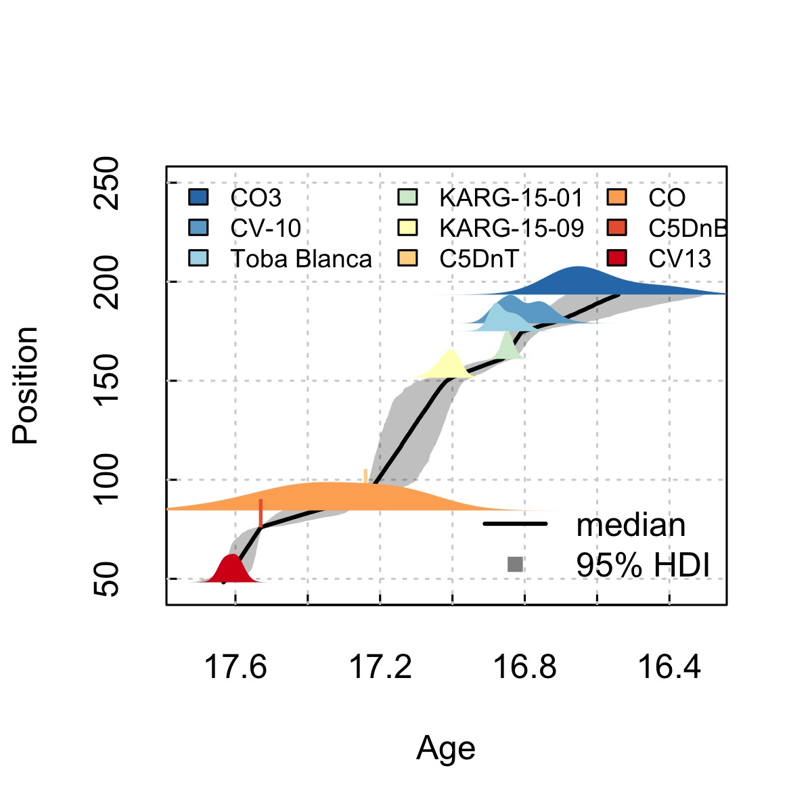
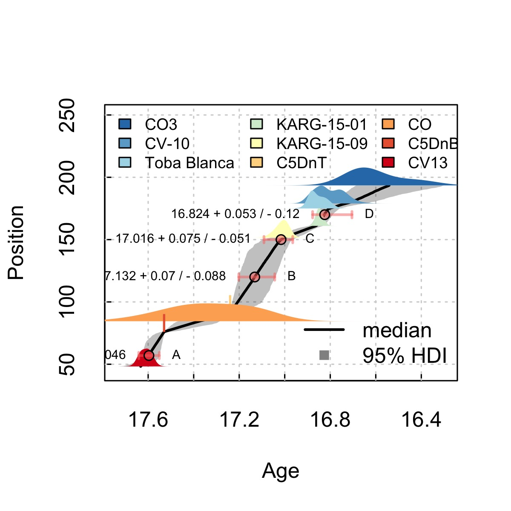

# modifiedBchron

This package provides a version of the [Bchron](https://github.com/andrewcparnell/Bchron/tree/master/R) R package, with features added to improve usability with deep time geochronology data (e.g., Argon-Argon, Uranium-Lead). If you use this package please cite Trayler et al.[^1] the deep time additions *and* Haslett & Parnell[^2] for the underlying `Bchron` model framework.

## Introduction

Bchron is a bayesian age-depth model implemented in R. Since it was originally designed for radiocarbon analyses It lacks some features that are desirable to those working with U-Pb or <sup>40</sup>Ar/<sup>39</sup>Ar geochronology data. In this package we have made several modifications including 

* We allow individual dates to be grouped to form complex probability density functions, reproducing the practice in both U-Pb and <sup>40</sup>Ar/<sup>39</sup>Ar geochronology of convolving many single crystal or spot analyses into a single age distribution.
* We have added an adaptive Markov Chain Monte Carlo Algorithm[^3] to ensure efficient exploration off parameter space, independent of the scale of the data (e.g., 1 Ma vs 1,000 ka, vs 1,000,000 a)
* We have removed automated outlier rejection. We instead recommend pre-screening data using established criteria based on the physical mechanisms of crystal growth and open system behavior in volcanic rocks. 

## Installation

modifiedBchron can be installed using the [`devtools`](https://github.com/r-lib/devtools) R package.  

```r
# copy this code into R
# install.packages('devtools')
devtools::install_github('robintrayler/modifiedBchron')
```

If this installation fails, you may also need to install [Rtools](https://cran.rstudio.com/bin/windows/Rtools/) on Windows or on macOS you may need to install command line tools.

```
# install command line tools on macOS
# copy this code into macOS Terminal (not R!)
xcode-select --install
```

Once `modifiedBchron` is installed it can be loaded as an R package by adding `library(modifiedBchron)` to the beginning of an R script. 

## Usage
### Data Inputs 
`modifiedBchron` requires several inputs, shown in the table below.

* `ids`: These are the sample names. Samples with the same `ids` will be combined into a single summed probability distribution. 
* `ages`: these are the radiometric ages for each sample. In this example, each age is a single zircon grain TIMS age.
* `ageSds`: The analytical uncertainty for each `ages` expressed as 1 standard deviation for gaussian distributions, or as a half-range for uniform distributions.
* `positions`: The stratigraphic position of each sample in ***units above base*** of the section. The positions for samples within an `ids` group ***must all match exactly***. If you are working with depths then you can simply make your measurements negative (e.g., 200 meters below core-top becomes -200 "above" base). 
* `positionThicknesses`: The stratigraphic uncertainty of each `positions` expressed as a half thickness. For example a volcanic as that is 2 meters thick at  100 meters above base would have a `positions` of *100* and a `positionThicknesss` of *1*. The thicknesses for each ids` group ***must match exactly***.
* `distType`: The statistical distribution to use for each sample. Defaults to Gaussian (`G`). Uniform distributions (`U`) are also supported.

|ids         |    age| ageSds| position| thickness|distType |
|:-----------|------:|------:|--------:|---------:|:--------|
|CV13        | 17.634|  0.016|    48.25|     3.125|G        |
|CV13        | 17.629|  0.025|    48.25|     3.125|G        |
|CV13        | 17.603|  0.029|    48.25|     3.125|G        |
|CV13        | 17.599|  0.019|    48.25|     3.125|G        |
|CV13        | 17.592|  0.020|    48.25|     3.125|G        |
|C5DnB       | 17.530|  0.005|    75.93|     1.000|U        |
|CO          | 17.119|  0.113|    84.50|     2.500|G        |
|CO          | 17.119|  0.113|    84.50|     2.500|G        |
|CO          | 17.180|  0.133|    84.50|     2.500|G        |
|CO          | 17.240|  0.103|    84.50|     2.500|G        |
|CO          | 17.351|  0.104|    84.50|     2.500|G        |
|CO          | 17.401|  0.123|    84.50|     2.500|G        |
|CO          | 17.431|  0.113|    84.50|     2.500|G        |
|CO          | 17.492|  0.123|    84.50|     2.500|G        |
|CO          | 17.613|  0.133|    84.50|     2.500|G        |
|C5DnT       | 17.240|  0.005|    91.10|     1.000|U        |
|KARG-15-09  | 17.028|  0.032|   151.50|     1.800|G        |
|KARG-15-09  | 16.997|  0.023|   151.50|     1.800|G        |
|KARG-15-01  | 16.854|  0.012|   161.00|     0.000|G        |
|KARG-15-01  | 16.850|  0.014|   161.00|     0.000|G        |
|KARG-15-01  | 16.849|  0.016|   161.00|     0.000|G        |
|KARG-15-01  | 16.846|  0.021|   161.00|     0.000|G        |
|KARG-15-01  | 16.836|  0.015|   161.00|     0.000|G        |
|Toba Blanca | 16.883|  0.018|   175.00|     0.000|G        |
|Toba Blanca | 16.859|  0.038|   175.00|     0.000|G        |
|Toba Blanca | 16.823|  0.030|   175.00|     0.000|G        |
|CV-10       | 16.877|  0.029|   179.00|     0.000|G        |
|CV-10       | 16.833|  0.025|   179.00|     0.000|G        |
|CV-10       | 16.760|  0.034|   179.00|     0.000|G        |
|CV-10       | 16.751|  0.057|   179.00|     0.000|G        |
|CO3         | 16.397|  0.088|   193.50|     1.500|G        |
|CO3         | 16.468|  0.098|   193.50|     1.500|G        |
|CO3         | 16.601|  0.086|   193.50|     1.500|G        |
|CO3         | 16.644|  0.081|   193.50|     1.500|G        |
|CO3         | 16.656|  0.083|   193.50|     1.500|G        |
|CO3         | 16.667|  0.113|   193.50|     1.500|G        |
|CO3         | 16.678|  0.079|   193.50|     1.500|G        |
|CO3         | 16.685|  0.082|   193.50|     1.500|G        |

### Example 

The core function of `modifiedBchron` is `ageModel()`. `ageModel()` takes the data shows in the table above and outputs a bayesian age model. 

```r
# load the package
library(modifiedBChron) 

# load the example data (csv of table above)
df <- read.csv(file = './data/example_data.csv')

# run the age model
age_model <- ageModel(ages = df$age,
                  ageSds = df$ageSds,
                  positions = df$position,
                  ids = df$ids,
                  positionThicknesses = df$thickness,
                  distTypes = df$distType,
                  predictPositions = seq(48.25, 193.50, by = 1),
                  MC = 10000,  # how many iterations 
                  burn = 2000) # how many iterations to discard
)
```

You can view the plot the output of the age model using the `modelPlot()` function. 

```r
modelPlot(model = age_model, 
          scale = 8) # changes the height of the probability distributions
```



You can predict the age of new stratigraphic positions using the `agePredict()` function. The `newPositions` and `newPositionThicknesses` follow the same general rules as `positions` and `positionThicknesses` in `ageModel()`.

```r
age_predictions <- agePredict(model = age_model, 
           newPositions = c(57, 120, 150),
           newPositionThicknesses = c(1, 3, 0.5))
```

Finally you can add `age_predictions` to a plot using `modelPlot()`. 

```r
modelPlot(model, 
          agePredictOutput = age_predictions,
          scale = 8, 
          ylim = c(45, 250))
```


[^1]: Trayler, R.B., Schmitz, M.D., Cuitiño, J.I., Kohn, M.J., Bargo, M.S., Kay, R.F., Strömberg, C.A.E., and Vizcaíno, S.F., 2020, An Improved Approach To Age-Depth Modeling In Deep Time: Implications For The Santa Cruz Formation, Argentina: Geological Society of America Bulletin, v. 132, p. 233–244.

[^2]: Haslett, J., and Parnell, A.C., 2008, A Simple Monotone Process With Application To Radiocarbon-Dated Depth Chronologies: Applied Statistics, v. 57, p. 399–418, doi:doi: 10.1111/j.1467-9876.2008.00623.x.

[^3]: Haario, H., Saksman, E., and Tamminen, J., 1999, Adaptive proposal distribution for random walk Metropolis algorithm: Computational Statistics, v. 14, p. 375–396.

